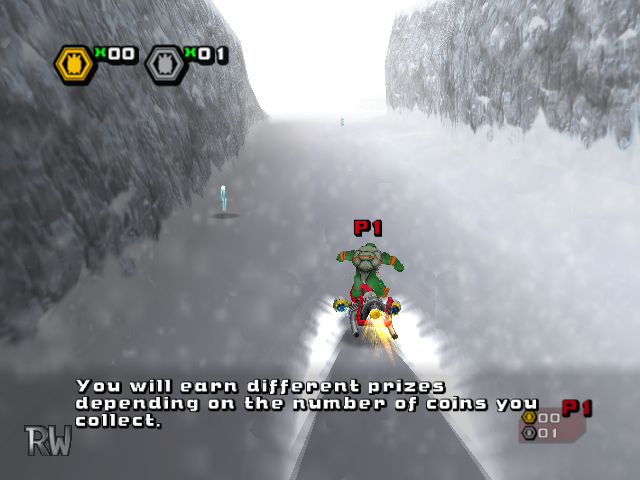
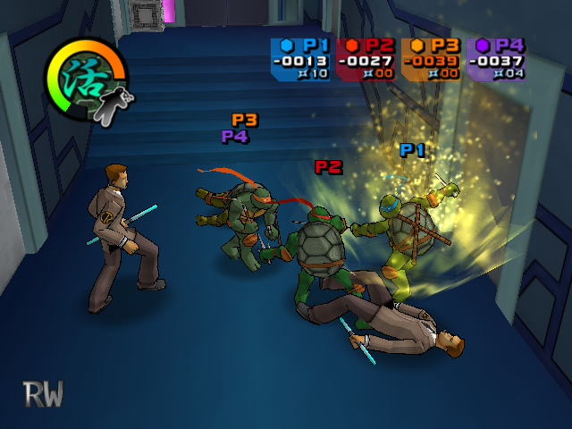
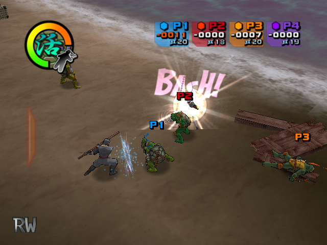
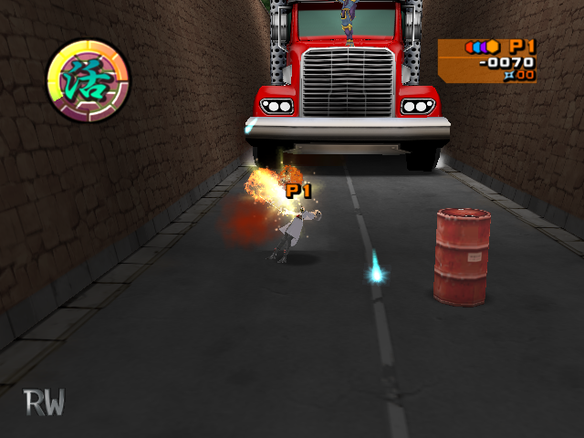

> # TMNT2
Reverse engineering PC version of Teenage Mutant Ninja Turtles 2: Battle Nexus
 (2004) based on dwarf pdb from leaked PS2 prototype [image](https://archive.org/details/TeenageMutantNinjaTurtles2BattleNexusJun142004prototype).

<!--  -->

&nbsp;
> # Current project status:
✔️ Basic gameplay\
✔️ Sound\
🔨 Enemies & Bosses (60/76)

&nbsp;
> # Building & Run
Currently building available only via premake5 & visual studio.\
This is simplified instruction, more detailed process you can see [here](https://github.com/xntrz/tmnt2/issues/1#issuecomment-2637289859).

**Requirements**
- Assets files from **PC version** of the game
- MS Visual Studio with fully support c++11 (Visual Studio 2015 or higher)
- MS DirectX 9.0 SDK with `DXSDK_DIR` environment variable is set

**Build**
- [Generate](https://premake.github.io/docs/Using-Premake/#using-premake-to-generate-project-files) `.sln` file by [premake5](https://premake.github.io/)
- Open `.sln` file in `build/` by Visual Studio
- Select [build configuration](https://learn.microsoft.com/en-us/visualstudio/ide/understanding-build-configurations) depending on your game region: NA or EU (how to know: see below [Game Region](#Game-region))
- Hit `Build solution`

**Run**
- Place executable to assets folder or specify path to them as **run arg**
- Run

**Run args**
- `-afspath=%PATH%` - specifies location of game assets files
- `-afsover` - allows to override afs files if exist at the same path
- `-wnd` - windowed mode
- `-noeval` - removes RW evaluation logo at left-down corner
- `-lang=%LOCALE%` - forcefully sets language (available only for EU build, value to set: `en`, `fr`, `de`, `es`, `it`)

&nbsp;
> # Game region
Retail PC game has 2 build types first one for North America (NA) and second one for Europe (EU). Both of them have minor changes for UI and some for gameplay. If you have some or all of the following files in your game directory: `TMNTF.DAT`, `TMNTG.DAT`, `TMNTI.DAT`, `TMNTS.DAT` - you have EU version, otherwise NA.

&nbsp;
> # 3rd party solutions used
* RenderWare v3.7 - [rw37sdk](https://archive.org/details/RenderwareStudio3.7SDKForWindows)
* Dwarf explorer - [dwex](https://github.com/sevaa/dwex)
* CRIWARE SDK - [crisdk](https://archive.org/details/cri-sdk)
* toon plugin - [rptoon](https://github.com/xntrz/rptoon)
