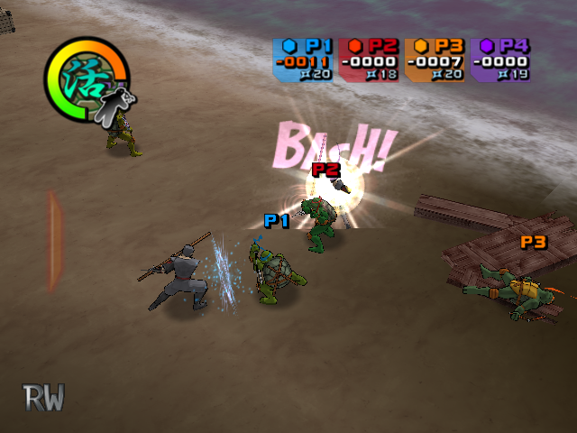
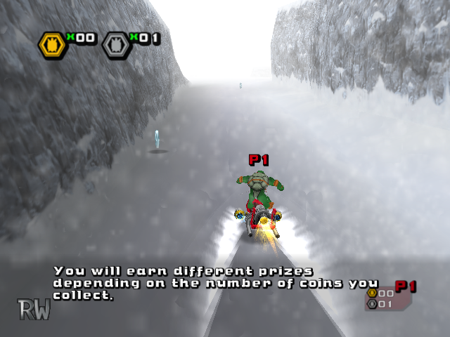

> # TMNT2

Reimplementation PC version of Teenage Mutant Ninja Turtles 2: Battle Nexus (2004). \
All names & `src/` structure restored by dwarf pdb from leaked PS2 prototype [image](https://archive.org/details/TeenageMutantNinjaTurtles2BattleNexusJun142004prototype).

Play [DEMO](https://xntrz.github.io/tmnt2-play/?demo) (require downloading of ~100MB of addition data)  
Play [FULL](https://xntrz.github.io/tmnt2-play/?full) (require owning of PC game version assets to mount at startup)    

&nbsp;
> # Building & Run
- [For Windows](README-build-win.md)
- [For Web](README-build-web.md)

&nbsp;
> # 3rd party solutions used
* RenderWare v3.7 - 
[rw37sdk](https://github.com/sigmaco/rwsdk-v3.7.0.2) /
[rw37src](https://github.com/sigmaco/rwsrc-v37-pc/tree/28d591e92a75a2367ce1f1789eb6798035afd53c)
* Dwarf explorer - [dwex](https://github.com/sevaa/dwex)
* CRIWARE SDK - [crisdk](https://archive.org/details/cri-sdk)
* GL4ES - [gl4es](https://github.com/ptitseb/gl4es)
* SDL3 - [sdl](https://github.com/libsdl-org/SDL)