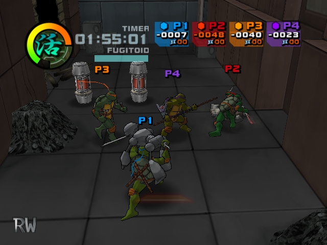
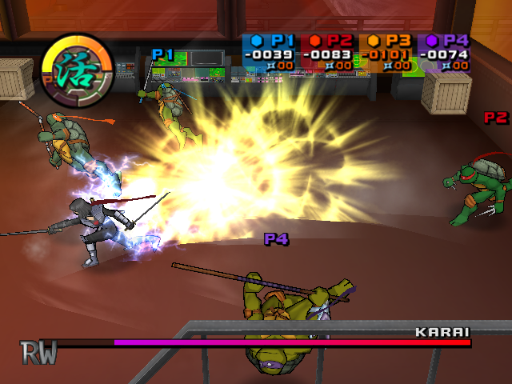

# TMNT2
#### Reverse engineering PC version of TMNT2: Battle Nexus (2004) based on dwarf pdb from leaked PS2 prototype [image](https://archive.org/details/TeenageMutantNinjaTurtles2BattleNexusJun142004prototype). 

# Current project status:
✔️ Basic gameplay\
✔️ SOUND: Voice & BGM\
🛠️ SOUND: SE \
❌ Enemies & Bosses
&nbsp;

# Building & Run
**Requirements**
- assets files from retail game
- visual studio with fully support c++11 (vs2015 or higher)

**Build**
- generate `.sln` file by [premake5](https://premake.github.io/)
- Open `.sln` file in `build/`
- Select Release or Debug build
- Hit `Build solution`

**Run**
- Place executable to assets folder
- Run

**Run args**
- `-afspath=%PATH%` - specifies location of game assets files
- `-afsover` - allows to override afs files if exist at the same path
- `-wnd` - windowed mode
- `-noeval` - removes rw evaluation logo at left-down corner

&nbsp;

# 3rd party solutions used
* RenderWare v3.7 - [rw37sdk](https://archive.org/details/RenderwareStudio3.7SDKForWindows)
* Dwarf explorer - [dwex](https://github.com/sevaa/dwex)
* CRIWARE SDK - [crisdk](https://archive.org/details/cri-sdk)
* toon plugin - [rptoon](https://github.com/xntrz/rptoon)
